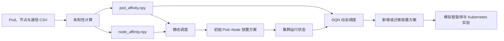

# Affinity Schedule

面向智能体 Pod 的亲和性感知调度实验项目。项目根据 Pod 间通信关系、资源竞争关系以及节点资源约束计算亲和性矩阵，并提供静态放置算法、基于 DQN 的动态调度原型，以及用于 Kubernetes 实验的模拟智能体和迁移脚本。

> 当前仓库更接近算法研究与实验原型，而不是可直接接入生产集群的完整调度器。运行前请先阅读[当前限制](#当前限制)。

## 核心能力

- 从 Pod、节点和通信关系 CSV 数据构建 NetworkX 图；
- 计算 Pod–Pod 软亲和性矩阵和 Pod–Node 硬约束矩阵；
- 提供 First Fit、Best Fit、Worst Fit 和 Multi Stage 四种静态调度策略；
- 使用 PyTorch DQN 在资源优先与亲和性优先两种策略之间进行动态选择；
- 生成模拟智能体的 Kubernetes Deployment/Service YAML；
- 模拟 CPU、内存与网络通信负载，并通过 Prometheus 暴露延迟指标；
- 提供基于 Kubernetes Python SDK 的 Pod 迁移实验脚本。

## 工作流程



主要代码分为四层：

1. `affinity/`：数据模型、通信图和亲和性矩阵；
2. `static_schedule/`：离线静态调度算法；
3. `dynamic_schedule/`：DQN 模型与动态调度原型；
4. `mock_agents/`、`migration.py`：集群实验辅助工具。

## 环境要求

- 推荐 Python 3.10；
- Python 依赖见 `requirements.txt`；
- 如需运行集群实验，还需要 Docker、可访问的 Kubernetes 集群和 `kubectl`；
- 模拟智能体的指标采集需要 Prometheus，展示可使用 Grafana。

仓库当前锁定了 `torch==2.2.2`、`numpy==1.26.4`、`pandas==2.2.3`、`networkx==3.4.2` 和 `kubernetes==32.0.1` 等版本。建议使用独立虚拟环境，避免与系统 Python 的依赖冲突。

```bash
git clone <repository-url>
cd affinity-schedule

python3.10 -m venv .venv
source .venv/bin/activate
python -m pip install --upgrade pip
python -m pip install -r requirements.txt
```

Windows PowerShell 激活命令：

```powershell
.\.venv\Scripts\Activate.ps1
```

## 快速开始

下面的示例使用 `data/scen/anti_2_*` 小型场景和现有节点数据，在系统临时目录中构造输入，不会覆盖仓库中的 CSV 或调度结果。

```bash
python - <<'PY'
from pathlib import Path
from shutil import copyfile
from tempfile import TemporaryDirectory

from affinity.affinity import cal_affinity
from static_schedule.first_fit_scheduler import FirstFitScheduler

root = Path.cwd()

with TemporaryDirectory(prefix="affinity-schedule-") as temp_dir:
    input_dir = Path(temp_dir)
    copyfile(root / "data/scen/anti_2_pods.csv", input_dir / "pods.csv")
    copyfile(root / "data/scen/anti_2_communication.csv", input_dir / "communication.csv")
    copyfile(root / "data/input/nodes.csv", input_dir / "nodes.csv")

    pod_affinity, node_affinity = cal_affinity(str(input_dir))
    scheduler = FirstFitScheduler(
        str(input_dir),
        pod_affinity,
        node_affinity,
    )
    plan = scheduler.schedule()

    if plan is None:
        raise RuntimeError("资源不足，无法为全部 Pod 生成放置方案")

    result = scheduler.check_and_gen(scheduler, plan)
    print("pod_affinity:", pod_affinity.shape)
    print("node_affinity:", node_affinity.shape)
    for item in result[:5]:
        print(f"{item.pod} -> {item.scheduled_node}")
PY
```

该示例的矩阵维度取决于输入中的 Pod 和节点数量。`anti_2` 场景包含 19 个 Pod，因此会生成 `(19, 19)` 的 Pod 亲和性矩阵；节点约束矩阵为 `(19, N)`，其中 `N` 是 `data/input/nodes.csv` 中的节点数。

如需保存调度结果，可在确认输出目录后调用：

```python
scheduler.check_and_output(
    scheduler,
    "data/plan",
    plan,
)
```

输出文件名由调度器的 `scheduler_name` 决定，例如 `first_fit_scheduler.csv`，格式为：

```csv
name,node
equipt-1,node-1
equipt-2,node-2
```

## 输入数据

### 静态调度输入

静态亲和性计算和调度以同一目录下的三个 CSV 文件为基础：

| 文件 | 必需字段 | 用途 |
| --- | --- | --- |
| `pods.csv` | `name,cpu,mem,gpu,disk,platform` | Pod 资源需求和所属平台 |
| `nodes.csv` | `name,cpu,memory,gpu,disk,net` | 节点可用资源 |
| `communication.csv` | `target,source,frequency,package,count` | Pod 间通信关系 |

可选或派生文件：

| 文件 | 用途 |
| --- | --- |
| `pod_affinity.npy` | Pod–Pod 软亲和性矩阵 |
| `node_affinity.npy` | Pod–Node 可放置矩阵，值为 `0` 或 `1` |
| `command.csv` | 指挥/平台关系数据；当前亲和性主流程未启用指挥关系计算 |

字段单位由数据提供方约定，但同一批输入必须保持一致。例如 `pods.csv` 的 `mem` 与 `nodes.csv` 的 `memory` 会在代码中映射到同一个资源属性。

### 动态调度输入

| 文件 | 必需字段 | 用途 |
| --- | --- | --- |
| `node_resource.csv` | `name,cpu_used(cores),cpu_free(cores),memory_used(GiB),memory_free(GiB),network_used(Mb/s),network_free(Mb/s)` | 节点实时资源状态 |
| `pod_node.csv` | `node,agents` | 节点上已经运行的智能体列表 |
| `agents.csv` | `name,cpu,memory,gpu,disk,platform` | 等待调度的智能体 |
| `pod_affinity.npy` | NumPy 二维矩阵 | 新智能体与已有智能体的亲和性 |

可以从静态调度结果生成 `pod_node.csv`：

```bash
python dynamic_schedule/get_running_pod_status.py \
  --input data/plan/multi_stage_scheduler.csv \
  --output /tmp/pod_node.csv
```

## 亲和性计算

入口位于 `affinity/affinity.py`。

```python
from affinity.affinity import cal_affinity

pod_affinity, node_affinity = cal_affinity("data/input")
```

当前实现包含：

- 网络亲和性：通信频率乘以包大小；
- 资源竞争亲和性：根据 CPU、内存、GPU、磁盘需求计算负向竞争分数；
- 节点硬约束：节点能够容纳 Pod 时记为 `1`，否则为 `0`；
- 归一化：各分量及最终 Pod 亲和性矩阵会被缩放到统一范围。

`Graph.attr` 当前启用网络亲和性和资源竞争亲和性；指挥关系亲和性代码仍保留在 `Graph.command_affinity()` 中，但没有被 `cal_affinity()` 调用。

若要持久化矩阵，可直接使用 NumPy：

```python
import numpy as np

np.save("data/output/pod_affinity.npy", pod_affinity)
np.save("data/output/node_affinity.npy", node_affinity)
```

## 静态调度

所有静态算法继承 `static_schedule.offline_scheduler.Scheduler`。

| 调度器 | 实现文件 | 策略 |
| --- | --- | --- |
| First Fit | `first_fit_scheduler.py` | 按节点顺序选择第一个可容纳 Pod 的节点 |
| Best Fit | `best_fit_scheduler.py` | 选择放置后资源匹配最紧凑的可用节点 |
| Worst Fit | `worst_fit_scheduler.py` | 选择资源余量相对更大的可用节点 |
| Multi Stage | `multi_stage_scheduler.py` | 亲和性层次聚类、簇到节点映射和资源微调 |

前三种算法会优先将无 GPU 需求的 Pod 放到普通节点，避免无谓占用 GPU 节点。通用调用方式如下：

```python
from affinity.affinity import cal_affinity
from static_schedule.best_fit_scheduler import BestFitScheduler

pod_affinity, node_affinity = cal_affinity("data/input")
scheduler = BestFitScheduler(
    "data/input",
    pod_affinity,
    node_affinity,
)
plan = scheduler.schedule()

if plan is None:
    raise RuntimeError("当前节点资源无法容纳全部 Pod")

if not scheduler.check(plan):
    raise RuntimeError("调度结果未通过资源校验")
```

仓库各调度文件底部的 `__main__` 示例包含历史绝对路径和旧构造函数签名，不建议直接执行；请使用上面的 Python API。

## 动态调度

`dynamic_schedule/` 使用 DQN 在两个动作之间进行选择：

- 动作 `0`：依据资源使用状态选点；
- 动作 `1`：依据 Pod 亲和性得分选点。

查看当前命令行参数：

```bash
python -m dynamic_schedule.main --help
```

完整调用接口为：

```bash
cd dynamic_schedule
PYTHONPATH=.. ../.venv/bin/python main.py \
  --nodes ../data/input/node_resource.csv \
  --pods ../data/input/pod_node.csv \
  --affinity ../data/input/pod_affinity.npy \
  --tasks ../data/input/agents.csv \
  --output /tmp/dynamic_schedule.csv
```

上面的命令展示了正确的路径与参数组织方式，但当前代码需要先解决以下模型维度问题才能完成推理：

- `model.py` 中训练环境和已保存权重按 8 个节点、24 维状态创建；
- `main.py` 中 `NODE_NAME` 只包含 5 个节点，实际生成 15 维状态；
- 当前权重通过相对路径 `model.pth` 加载，因此应从 `dynamic_schedule/` 目录启动。

重新训练入口为：

```bash
cd dynamic_schedule
../.venv/bin/python model.py
```

该训练环境目前使用随机生成的演示状态和奖励，接入真实集群前需要重新定义状态、动作、奖励和历史数据加载逻辑。

## 模拟智能体与 Kubernetes 实验

### 构建模拟智能体镜像

```bash
docker build -t affinity-mock-agent:dev mock_agents
```

模拟智能体支持以下参数：

```text
--cores       CPU 负载规模
--memory      内存占用，GB
--frequency   发送频率
--package     单次消息大小，MB
--target      目标 Service 名称或地址
--amount      总发送次数
```

服务监听 `11111/TCP`，Prometheus 指标监听 `11112/TCP`。

### 生成 Kubernetes YAML

```bash
python mock_agents/generate.py \
  --pods <pod-resource.csv> \
  --communication <communication.csv> \
  --nodename <pod-node.csv> \
  --output <generated.yaml>
```

生成器要求资源文件和节点映射中的智能体名称一致。当前模板中镜像地址硬编码为 `registry.cn-hangzhou.aliyuncs.com/lexmargin/agent:v0.5`；如使用自行构建的镜像，需要先修改 `mock_agents/generate.py`。

部署前需为节点添加匹配的标签：

```bash
kubectl label node <kubernetes-node-name> agent=<logical-node-name>
kubectl apply -f mock_agents/yamls/monitor.yaml
kubectl apply -f <generated.yaml>
```

### Pod 迁移实验

```bash
python migration.py <pod-name> <target-node-name>
```

该脚本会读取本地 kubeconfig，复制原 Pod 到目标节点，等待新 Pod 进入 `Running` 后删除旧 Pod。执行前必须检查并修改脚本顶部硬编码的命名空间 `baowj`，同时确认工作负载允许以这种方式复制和删除。

## 项目结构

```text
affinity-schedule/
├── affinity/               # 资源模型、场景数据生成和亲和性计算
├── static_schedule/        # 静态调度基类与四种算法
├── dynamic_schedule/       # DQN 模型、权重和动态调度入口
├── mock_agents/            # 负载模拟程序、镜像和 YAML 生成器
├── data/
│   ├── input/              # 默认输入和预计算矩阵
│   ├── output/             # 亲和性矩阵输出
│   ├── plan/               # 各静态算法的放置结果
│   └── scen/               # 多组实验场景
├── util/                   # 日志工具
├── migration.py            # Kubernetes Pod 迁移实验脚本
└── requirements.txt        # Python 依赖锁定
```

## 测试

测试文件分布在各模块的 `unit_test.py` 中。可先运行无外部依赖的轻量用例：

```bash
python -m pytest mock_agents/unit_test.py -q
```

按模块运行其他测试：

```bash
python -m pytest affinity/unit_test.py -v
python -m pytest static_schedule/unit_test.py -v
python -m pytest dynamic_schedule/unit_test.py -v
```

注意：当前部分测试更接近实验脚本，会使用绝对路径、绘制交互图形、覆盖 `data/input` 或 `data/plan` 中的数据，并依赖当前数据规模和模型状态。运行完整测试前请先检查测试代码并备份数据。

## 当前限制

- 项目尚未提供统一的包配置或顶层 CLI；
- 多个 `__main__` 和测试仍包含开发机绝对路径；
- 默认 `data/input` 包含 1000 个 Pod，基线算法可能因节点容量不足返回 `None`；
- Multi Stage 调度器包含针对特定实验规模的聚类上限和节点映射假设；
- DQN 推理当前存在 5 节点运行状态与 8 节点模型权重的维度不一致；
- 动态资源校验主要使用 CPU 和内存，GPU、磁盘和网络尚未完整纳入决策；
- 模拟智能体没有真实模拟 GPU 和磁盘负载；
- Kubernetes 镜像地址、节点标签、命名空间等配置仍有硬编码；
- 仓库未声明许可证，使用或分发前请先向项目维护者确认授权范围。
